# E-Commerce Website
This repository contains the code for an e-commerce website built using Node.js and the Handlebars (hbs) template engine. The website features a shopping cart where users can add items and proceed to checkout. The site is connected to a MongoDB database for storing product information and user data.

to run the service you will need to install all of the package include in package.json
```
npm install
```
<hr/>
After install all the package needed, you will need to create a new MongoDB collection,

to create a mongodb collection :
```
https://www.mongodb.com/atlas/database
```

next paste you mongodb collection url to your app.js
```
mongoose.connect('YOUR_MONGODB_URL')
```

finally you will need to insert information into the Products table, You can use my dummy data by cd into seed directory and enter the command
```
node product-seeder.js
```
<hr/>
To run the website type in the command :

```
npm start
```
or 
```
node app.js
```

Snapshot of the website : 
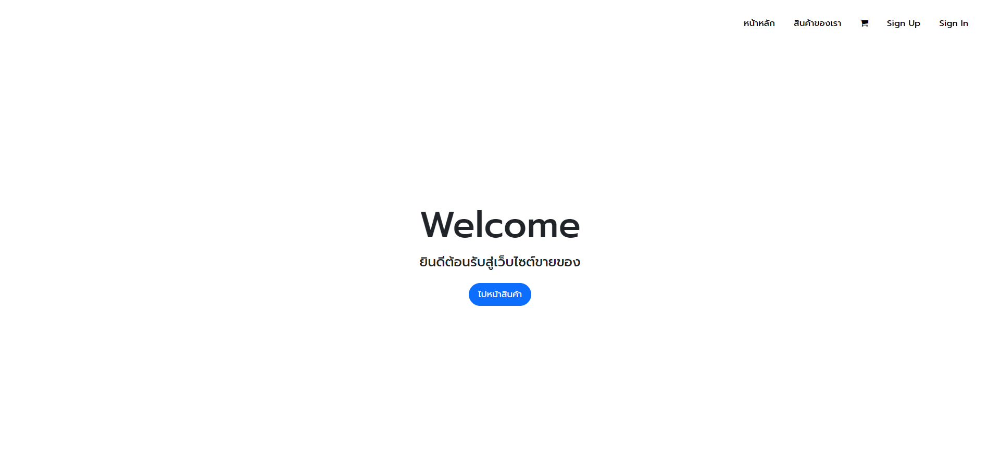
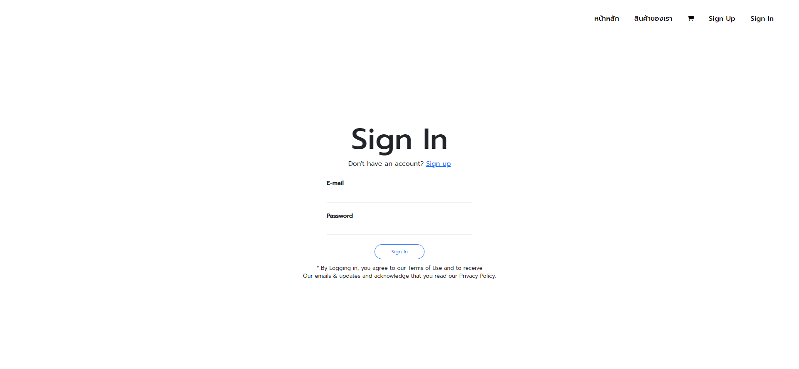
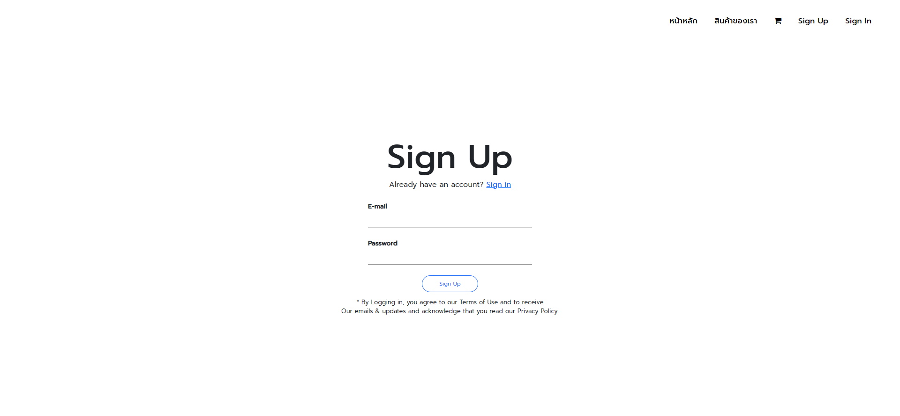
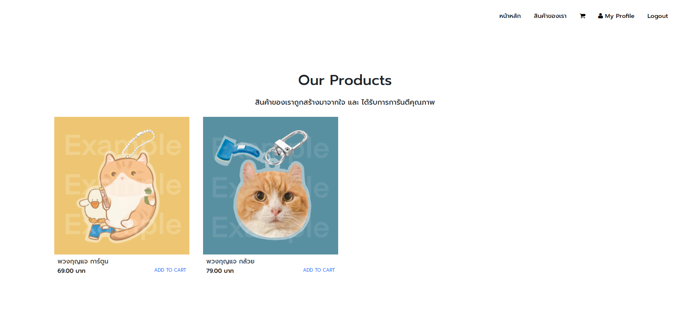

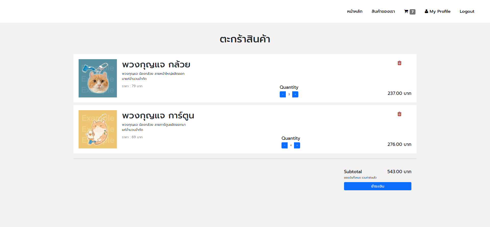
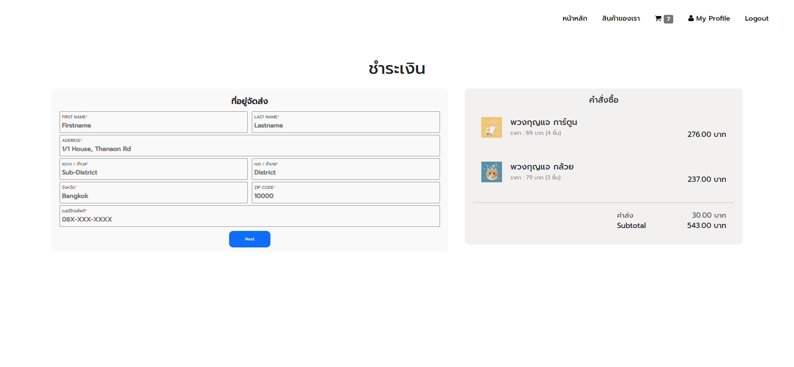
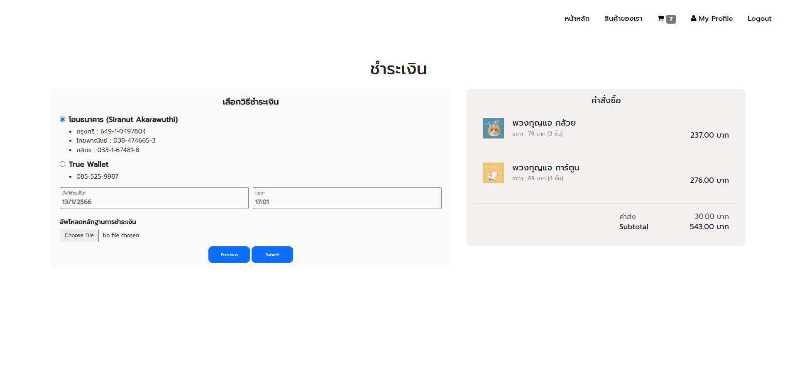
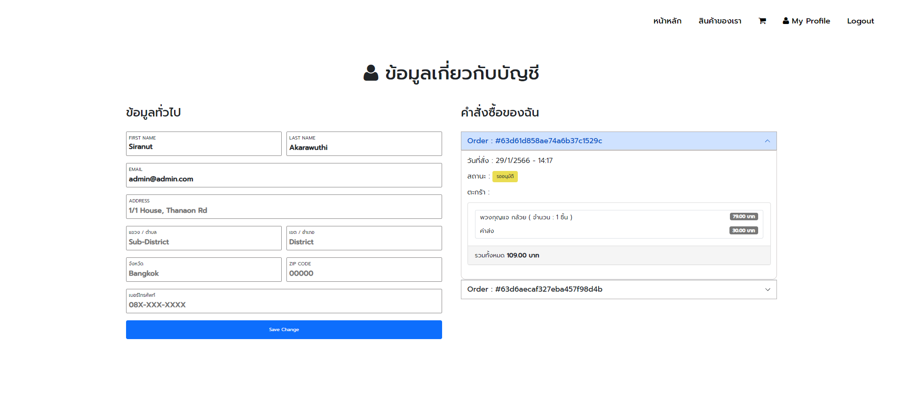
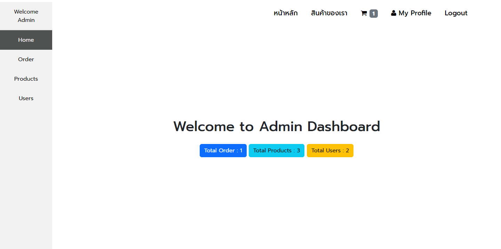
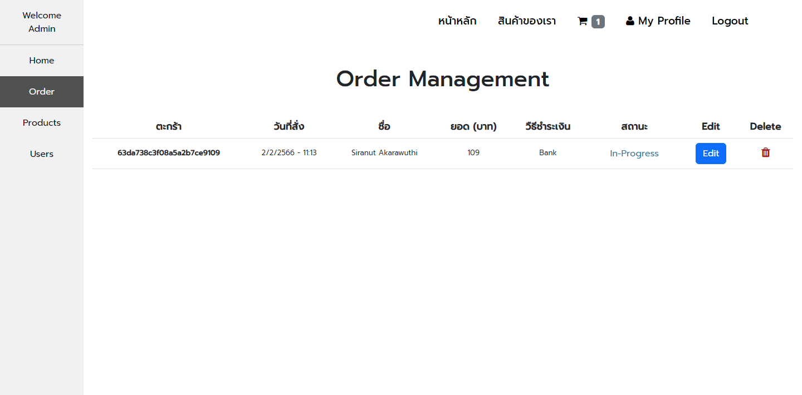
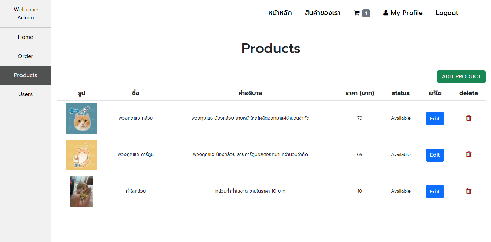
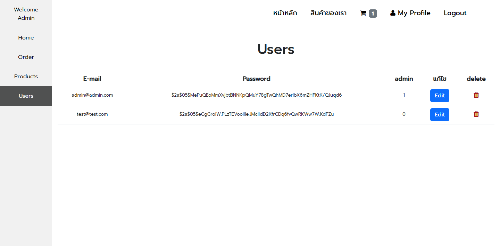
